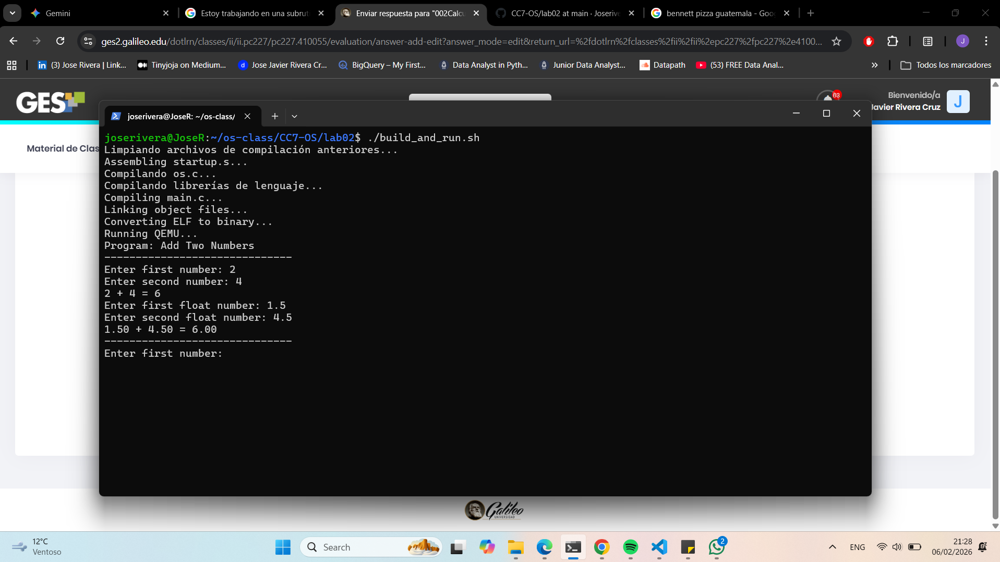

# Lab 002: Calculadora Bare-Metal ARM (CC7)

Este proyecto implementa una calculadora funcional de punto flotante sobre hardware **ARM VersatilePB** sin el uso de una biblioteca estándar de C (`libc`). El sistema demuestra la arquitectura de capas necesaria para construir un Sistema Operativo desde cero.

## 🏗️ Arquitectura del Sistema

El software se ha estructurado en tres niveles de abstracción para garantizar la modularidad:

### 1. Nivel de Usuario (User Level)
* **`main.c`**: Contiene la lógica de la aplicación. Utiliza las abstracciones de la librería para realizar operaciones de suma, resta, multiplicación, división y módulo.

### 2. Nivel de Librería de Lenguaje (Language Library)
* **`stdio.c / stdio.h`**: Implementación de `PRINT` y `READ`. Estas funciones actúan como envoltorios (wrappers) de alto nivel que soportan formatos como `%d`, `%s`, `%c` y `%f`.
* **`string.c / string.h`**: Funciones auxiliares para manipulación de cadenas de texto.

### 3. Nivel de SO / Hardware (OS Level)
* **`os.c / os.h`**: Controladores (drivers) del UART0 para comunicación serial. Incluye funciones de conversión de bajo nivel como `uart_atoi`, `uart_itoa`, `uart_atof` y `uart_ftoa`.
* **`root.s`**: Archivo de arranque en ensamblador que inicializa el Stack Pointer (SP) y transfiere el control a la función `main`.
* **`linker.ld`**: Script de enlazado que organiza las secciones de memoria, situando el código en la dirección `0x10000`.

---

## 🚀 Funcionalidades Implementadas

- **I/O Formateado**: Sistema propio de entrada y salida capaz de procesar múltiples argumentos.
- **Aritmética de Punto Flotante**: Capacidad de procesar números decimales mediante implementaciones manuales de conversión ASCII-Float.
- **Manejo de Operaciones**:
    - Suma (`+`)
    - Resta (`-`)
    - Multiplicación (`*`)
    - División (`/`) con protección contra división por cero.
    - Módulo (`%`) para enteros.

---

## 🔧 Detalles de Compilación (Solución de errores AEABI)

Para que el sistema funcione, el script de construcción (`build_and_run.sh`) incluye el flag `-lgcc` y vincula mediante `gcc` en lugar de `ld` directamente. Esto permite que operaciones como `num1 / num2` sean procesadas correctamente por software.


## Lab en funcionamiento.




---

## 💻 Ejecución

Para compilar y correr el sistema en el emulador QEMU:

```bash
# Dar permisos de ejecución
chmod +x build_and_run.sh

# Compilar y ejecutar
./build_and_run.sh